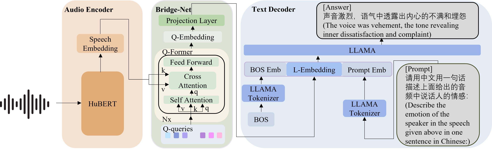

# SECAP: Speech Emotion Captioning with Large Language Model



This repository contains the implementation of the paper "SECap: Speech Emotion Captioning with Large Language Model". It includes the model code, training and testing scripts, and a test dataset. The test dataset consists of 600 wav audio files and their corresponding emotion descriptions.

## Datset
We public the 600-test dataset in the `dataset` folder. The dataset consists of 600 wav audio files and their corresponding emotion descriptions. 

The `dataset` folder contains the following files:

wav: the folder contains 600 wav audio files.

text.txt: the file contains the transcribtion of the 600 audio files.

fid2captions.json: the file contains the emotion captions of the 600 audio files.

## Download
You can simply download the repository by using the following command:

```
git clone https://github.com/xuyaoxun/SECaps.git
```

## Installation

To install the project dependencies, use the following command:

conda create --name secap --file requirements.txt

## Pretrained Model
You can download the pretrained model from [todo][here](https://drive.google.com/file/d/1-0Z3Z3Z3Z3Z3Z3Z3Z3Z3Z3Z3Z3Z3Z3Z/view?usp=sharing) and put it in the main folder.

Also, you need to download the pretrained weights folder from [todo][here](todo) and put it in the main folder.

## Inference and Testing

If you want to test the model on your own data, use the `inference.py` script. For example:
```
cd scripts
python inference.py --wavdir /path/to/your/audio.wav
```


If you want to test the model on the provided test dataset of 600 audio files and their emotion descriptions, use the `test.py` script. For example:

```
cd scripts
python test.py 
```


## Training

If you want to train the model, use the `train.py` script. But first, you need to create a training dataset. The training dataset should be a folder containing audio files and their corresponding emotion descriptions.
For example:

```
cd scripts
python train.py 
```


## Calculating Similarity

If you want to calculate the similarity between the generated descriptions and the ground truth descriptions, use the `tool/get_sentence_simi.py` script. For example:

```
cd tool
# modify the path in get_sentence_simi.py
python get_sentence_simi.py
```
## Citation

If you use this repository in your research, please cite our paper:

@article{SECap,
  title={SECap: Speech Emotion Captioning with Large Language Model},
  
}
